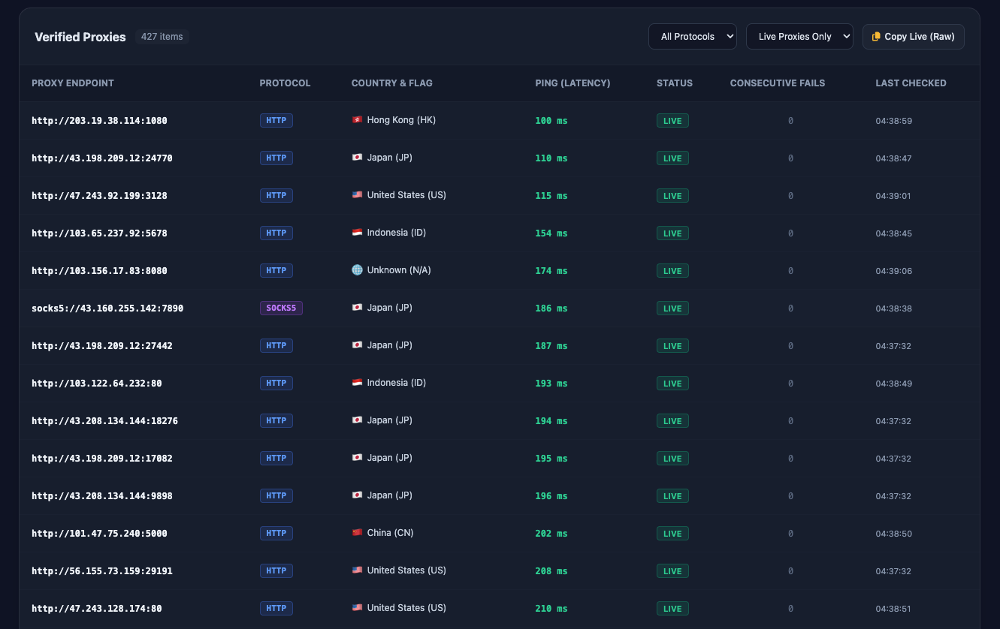

# 🛡️ Free Proxy Checker & Pool Manager

<div align="center">



An automated high-performance proxy aggregator, validator, and live pool manager featuring dual-stream parallel screening, multi-source ingestion, real-time socket latency checking, and persistent SQLite WAL storage.

</div>

---

## ⚠️ Disclaimer & Acceptable Use Policy

> [!CAUTION]
> ### 🛑 STRICT DISCLAIMER & TERMS OF USE
> - **Educational & Research Purposes Only**: This tool is designed and intended strictly for educational purposes, academic research, network security testing, load balancing verification, and authorized public data crawling.
> - **Strict Prohibition of Malicious & Illegal Activities**: **DO NOT** use this software or any proxies gathered through it for unauthorized network intrusion, cyberattacks, DDoS attacks, credential stuffing, spamming, fraud, identity theft, or any activities that violate applicable local, national, or international laws.
> - **Public Proxy Security Advisory**: Publicly accessible proxies are operated by unknown third parties and do not guarantee encryption, privacy, or safety. **Never transmit sensitive credentials, financial data, passwords, or personally identifiable information (PII)** over public proxies.
> - **Limitation of Liability**: The authors and maintainers assume no liability and are not responsible for any misuse, damage, data breaches, or legal consequences resulting from the execution or deployment of this software.

---

## ✨ Features

- ⚡ **High-Performance Concurrent Checker**: Asynchronous native socket & streaming agents supporting `HTTP`, `HTTPS`, `SOCKS4`, and `SOCKS5` protocols with tuneable concurrency.
- 📐 **Pyramid Lifecycle Management**: Automatically tracks proxy health, success/failure counts, latency, and prunes dead proxies after consecutive failed checks.
- 🔄 **Multi-Source Periodic Ingestion**: Ingests and aggregates proxies from multiple remote raw lists on customizable cron schedules.
- 🌍 **Built-in GeoIP Resolution**: Enriches validated proxies with Country, City, Region, and Anonymity levels.
- 📊 **Real-Time Web Dashboard**: Built-in modern SPA dashboard featuring live health stats, instant search, latency histograms, and Server-Sent Events (SSE).
- 📖 **Interactive Swagger / OpenAPI Docs**: Explore, test, and integrate API endpoints directly via `/swagger`.
- 🔌 **Crawler-Ready Raw Endpoints**: Dedicated `/api/proxies/raw` endpoint for instant integration with headless browsers, Playwright, Puppeteer, and web scrapers.
- 🗄️ **Persistent SQLite with WAL Mode**: Embedded zero-config database with high-throughput concurrent reads and writes.

---

## 🚀 Quick Start

### Option 1: Run with Bun (Local Development)

Ensure [Bun](https://bun.sh) (v1.2+) is installed on your system:

```bash
# 1. Clone the repository
git clone https://github.com/2noScript/free-proxy-checker.git
cd free-proxy-checker

# 2. Install dependencies
bun install

# 3. Start development server with hot-reload
bun run dev

# Or start in production mode
bun run start
```

Access the application in your browser:
- **Web Dashboard**: [http://localhost:8340](http://localhost:8340)
- **Interactive API Docs**: [http://localhost:8340/swagger](http://localhost:8340/swagger)

---

### Option 2: Run with Docker Compose

```bash
# Start container in detached mode
docker compose up -d

# Check service logs
docker compose logs -f
```

---

## ⚙️ Configuration & Environment Variables

Configure application settings via environment variables or a `.env` file:

| Variable | Default | Description |
| :--- | :--- | :--- |
| `PORT` | `8340` | Server listening port |
| `HOST` | `0.0.0.0` | Server host binding address |
| `DB_PATH` | `data/proxies.db` | Path to the SQLite database file |
| `CONCURRENCY_LIMIT` | `30` | Maximum concurrent background health checks |
| `TIMEOUT_MS` | `2500` | Socket connection timeout in milliseconds |
| `MAINTENANCE_INTERVAL_MINUTES` | `3` | Interval between background re-validation cycles |
| `MAX_CONSECUTIVE_FAILS` | `2` | Number of consecutive fails before marking a proxy as DEAD |

---

## 📡 API Reference & cURL Examples

Interactive OpenAPI 3.1.0 schemas, parameters, and live request builders are available at:

👉 **[Swagger UI Documentation](http://localhost:8340/swagger)** (`/swagger` or `/doc`)

### Quick cURL Usage

#### 1. Retrieve Verified Live Proxies (JSON)

```bash
# Get all verified live proxies (sorted by lowest latency)
curl -s http://127.0.0.1:8340/api/proxies

# Filter by SOCKS5 protocol and Latency <= 300ms
curl -s "http://127.0.0.1:8340/api/proxies?protocol=socks5&max_latency=300"

# Filter by Country and Elite Anonymity
curl -s "http://127.0.0.1:8340/api/proxies?country=US&anonymity=elite"

# Filter by Specific Source ID
curl -s "http://127.0.0.1:8340/api/proxies?source_id=iplocate-all"
```

#### 2. Export Raw Text Lines (Crawler & Scraper Ready)

```bash
# Export as protocol URLs (socks5://ip:port or http://ip:port)
curl -s http://127.0.0.1:8340/api/proxies/raw

# Export as plain ip:port format
curl -s "http://127.0.0.1:8340/api/proxies/raw?format=ip_port"
```

#### 3. System Metrics & Dual-Stream Status

```bash
curl -s http://127.0.0.1:8340/api/stats
```

---

## 🤝 Contributing

Contributions are welcome! Please read our [Contributing Guide](CONTRIBUTING.md) and [Code of Conduct](CODE_OF_CONDUCT.md) before submitting pull requests.

---

## 🔒 Security

For vulnerability disclosures and security best practices, refer to our [Security Policy](SECURITY.md).

---

## 📄 License

This project is licensed under the [MIT License](LICENSE).
